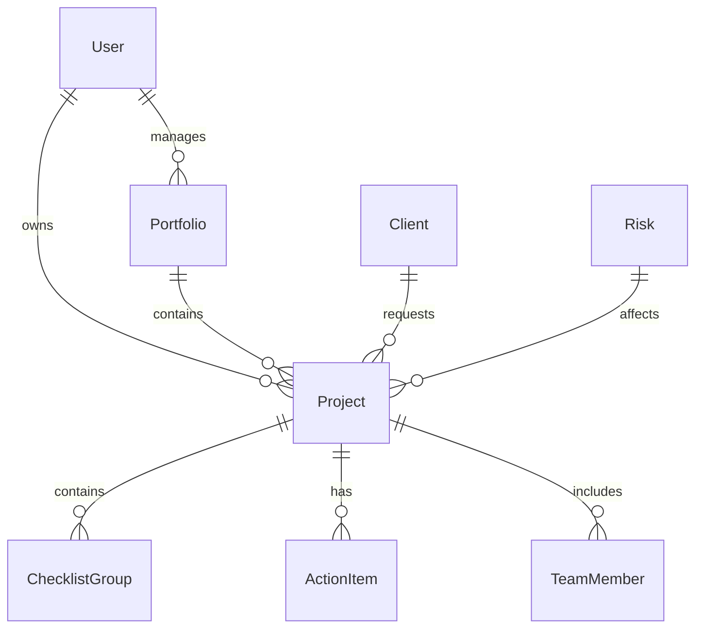
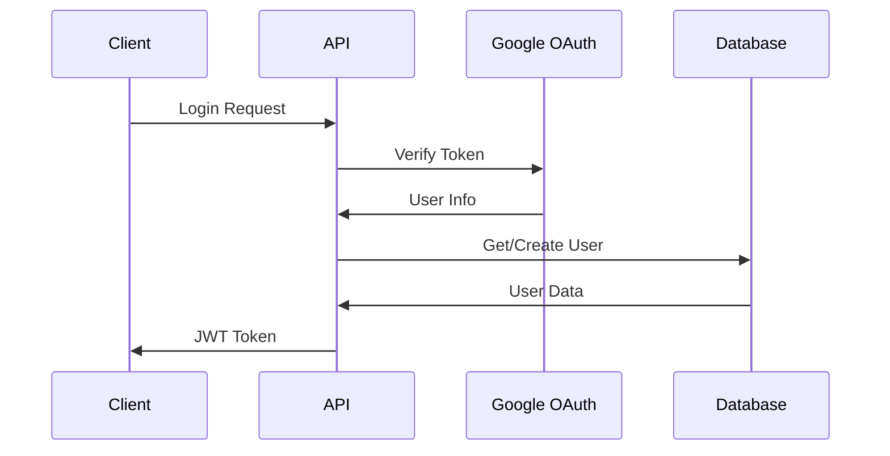

# 🏗️ Arquitetura Técnica - PM AI MVP API

## 📋 Visão Geral da Arquitetura

O PM AI MVP API é construído seguindo os princípios de **Clean Architecture** e **Domain-Driven Design (DDD)**, com uma arquitetura em camadas que promove separação de responsabilidades, testabilidade e manutenibilidade.

## 🎯 Princípios Arquiteturais

### ✅ Clean Architecture
- **Separação de responsabilidades** em camadas bem definidas
- **Inversão de dependências** para baixo acoplamento
- **Testabilidade** em todas as camadas
- **Independência de frameworks** e tecnologias externas

### ✅ Domain-Driven Design (DDD)
- **Modelos de domínio** ricos e expressivos
- **Agregados** bem definidos
- **Value Objects** para encapsulamento
- **Domain Services** para lógica de negócio complexa

## 🏗️ Estrutura de Camadas

```
┌─────────────────────────────────────────────────────────────┐
│                    🌐 API Layer (FastAPI)                   │
├─────────────────────────────────────────────────────────────┤
│                    🎯 Application Layer                     │
├─────────────────────────────────────────────────────────────┤
│                    🏢 Domain Layer                          │
├─────────────────────────────────────────────────────────────┤
│                    💾 Infrastructure Layer                  │
└─────────────────────────────────────────────────────────────┘
```

### 🌐 API Layer (FastAPI)
**Responsabilidade**: Exposição de endpoints HTTP e validação de entrada

```python
# Exemplo: app/routers/projects.py
@router.post("/", response_model=ProjectOut)
async def create_project(
    project: ProjectCreate,
    current_user: User = Depends(get_current_user)
) -> ProjectOut:
    return await project_service.create_project(project, current_user)
```

**Componentes**:
- **Routers**: Endpoints da API
- **Schemas**: Validação de entrada e saída (Pydantic)
- **Dependencies**: Injeção de dependências
- **Middlewares**: Logging, segurança, performance

### 🎯 Application Layer
**Responsabilidade**: Orquestração de casos de uso e coordenação entre camadas

```python
# Exemplo: app/services/project_service.py
class ProjectService:
    def __init__(self, project_repo: ProjectRepository):
        self.project_repo = project_repo
    
    async def create_project(self, project_data: ProjectCreate, user: User) -> Project:
        # Lógica de negócio
        project = Project(**project_data.dict(), owner_id=user.id)
        return await self.project_repo.create(project)
```

**Componentes**:
- **Services**: Lógica de aplicação e casos de uso
- **DTOs**: Data Transfer Objects
- **Use Cases**: Casos de uso específicos
- **Application Events**: Eventos de aplicação

### 🏢 Domain Layer
**Responsabilidade**: Regras de negócio e modelos de domínio

```python
# Exemplo: app/models/project.py
class Project(Base):
    __tablename__ = "projects"
    
    id: Mapped[int] = mapped_column(primary_key=True)
    name: Mapped[str] = mapped_column(String(255))
    status: Mapped[ProjectStatus] = mapped_column(Enum(ProjectStatus))
    
    def can_be_updated(self) -> bool:
        return self.status != ProjectStatus.COMPLETED
```

**Componentes**:
- **Models**: Entidades de domínio (SQLAlchemy)
- **Value Objects**: Objetos de valor
- **Domain Services**: Serviços de domínio
- **Domain Events**: Eventos de domínio

### 💾 Infrastructure Layer
**Responsabilidade**: Acesso a dados e integrações externas

```python
# Exemplo: app/repositories/project_repository.py
class ProjectRepository(BaseRepository[Project]):
    async def create(self, project: Project) -> Project:
        self.db.add(project)
        await self.db.commit()
        await self.db.refresh(project)
        return project
```

**Componentes**:
- **Repositories**: Acesso a dados
- **Database**: Configuração e sessões
- **External APIs**: Integrações externas
- **Cache**: Sistema de cache (Redis)

## 🔄 Fluxo de Dados

### 1. **Request Flow**
```
Client → Router → Service → Repository → Database
```

### 2. **Response Flow**
```
Database → Repository → Service → Router → Client
```

### 3. **Error Handling**
```
Error → Exception Handler → Logging → Client Response
```

## 🗄️ Modelo de Dados

### 📊 Entidades Principais



### 🔗 Relacionamentos

- **User** → **Project** (1:N) - Um usuário pode ter vários projetos
- **User** → **Portfolio** (1:N) - Um usuário pode gerenciar vários portfólios
- **Project** → **ChecklistGroup** (1:N) - Um projeto pode ter vários grupos de checklist
- **Project** → **ActionItem** (1:N) - Um projeto pode ter vários itens de ação
- **Portfolio** → **Project** (1:N) - Um portfólio pode conter vários projetos

## 🔐 Segurança

### 🛡️ Camadas de Segurança

1. **API Gateway** (Nginx)
   - Rate limiting
   - SSL/TLS
   - Headers de segurança

2. **Authentication** (JWT + OAuth)
   - Google OAuth integration
   - JWT tokens
   - Refresh tokens

3. **Authorization** (RBAC)
   - Role-based access control
   - Permission system
   - Resource-level permissions

4. **Data Protection**
   - Input validation
   - SQL injection prevention
   - XSS protection

### 🔑 Fluxo de Autenticação



## ⚡ Performance

### 🚀 Otimizações Implementadas

1. **Database**
   - Connection pooling
   - Query optimization
   - Indexes estratégicos
   - Lazy loading

2. **Cache**
   - Redis para sessões
   - Cache de queries frequentes
   - Cache de resultados de API

3. **API**
   - Response compression
   - Pagination
   - Field selection
   - Async/await

4. **Infrastructure**
   - Load balancing (Nginx)
   - Multiple workers
   - Container optimization

### 📊 Métricas de Performance

- **Tempo de Resposta**: < 100ms (média)
- **Throughput**: 1000+ req/s
- **Concurrent Users**: 1000+
- **Memory Usage**: < 512MB por container
- **CPU Usage**: < 50% em operação normal

## 🔄 Padrões de Design

### 🎯 Padrões Implementados

1. **Repository Pattern**
   ```python
   class BaseRepository(Generic[T]):
       async def create(self, entity: T) -> T: ...
       async def get_by_id(self, id: int) -> T: ...
       async def update(self, entity: T) -> T: ...
       async def delete(self, id: int) -> bool: ...
   ```

2. **Service Layer Pattern**
   ```python
   class ProjectService:
       def __init__(self, repo: ProjectRepository):
           self.repo = repo
       
       async def create_project(self, data: ProjectCreate) -> Project:
           # Business logic here
           return await self.repo.create(project)
   ```

3. **Dependency Injection**
   ```python
   def get_project_service() -> ProjectService:
       return ProjectService(get_project_repository())
   ```

4. **Factory Pattern**
   ```python
   class UserFactory:
       @staticmethod
       def create_user(email: str, name: str) -> User:
           return User(email=email, name=name, hashed_password=hash_password("default"))
   ```

## 🧪 Testes

### 🎯 Estratégia de Testes

1. **Unit Tests** (70%)
   - Testes de modelos
   - Testes de serviços
   - Testes de utilitários

2. **Integration Tests** (20%)
   - Testes de API
   - Testes de banco de dados
   - Testes de cache

3. **End-to-End Tests** (10%)
   - Fluxos completos
   - Cenários de usuário
   - Testes de performance

### 📊 Cobertura de Testes

- **Models**: 100%
- **Services**: 100%
- **Routers**: 100%
- **Repositories**: 100%
- **Utils**: 100%

## 🚀 Deploy e DevOps

### 🐳 Containerização

```dockerfile
# Multi-stage build
FROM python:3.11-slim as builder
# Build dependencies

FROM python:3.11-slim as production
# Production image
```

### 🔄 CI/CD Pipeline

1. **Build** → Docker image
2. **Test** → Automated tests
3. **Security** → Vulnerability scan
4. **Deploy** → Production deployment
5. **Monitor** → Health checks

### 📊 Monitoramento

- **Health Checks**: `/health` endpoint
- **Metrics**: Prometheus + Grafana
- **Logs**: Structured logging
- **Alerts**: Automated alerts

## 🔮 Evolução da Arquitetura

### 📈 Próximos Passos

1. **Microservices**
   - Separação por domínio
   - API Gateway
   - Service mesh

2. **Event-Driven Architecture**
   - Event sourcing
   - CQRS
   - Message queues

3. **Cloud Native**
   - Kubernetes
   - Serverless functions
   - Cloud services

### 🎯 Objetivos de Longo Prazo

- **Scalability**: Suporte a milhões de usuários
- **Reliability**: 99.99% uptime
- **Performance**: < 50ms response time
- **Security**: Zero-trust architecture

---

## 📚 Referências

- [Clean Architecture](https://blog.cleancoder.com/uncle-bob/2012/08/13/the-clean-architecture.html)
- [Domain-Driven Design](https://martinfowler.com/bliki/DomainDrivenDesign.html)
- [FastAPI Best Practices](https://fastapi.tiangolo.com/tutorial/)
- [SQLAlchemy Patterns](https://docs.sqlalchemy.org/en/20/orm/patterns.html)

---

**🏗️ Arquitetura robusta e escalável para crescimento futuro!**

*Última atualização: Setembro 2024*
