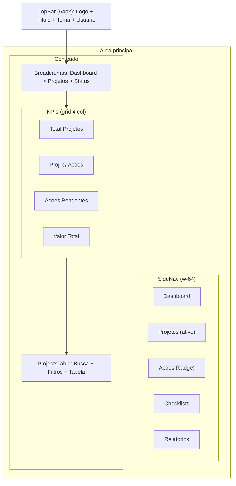
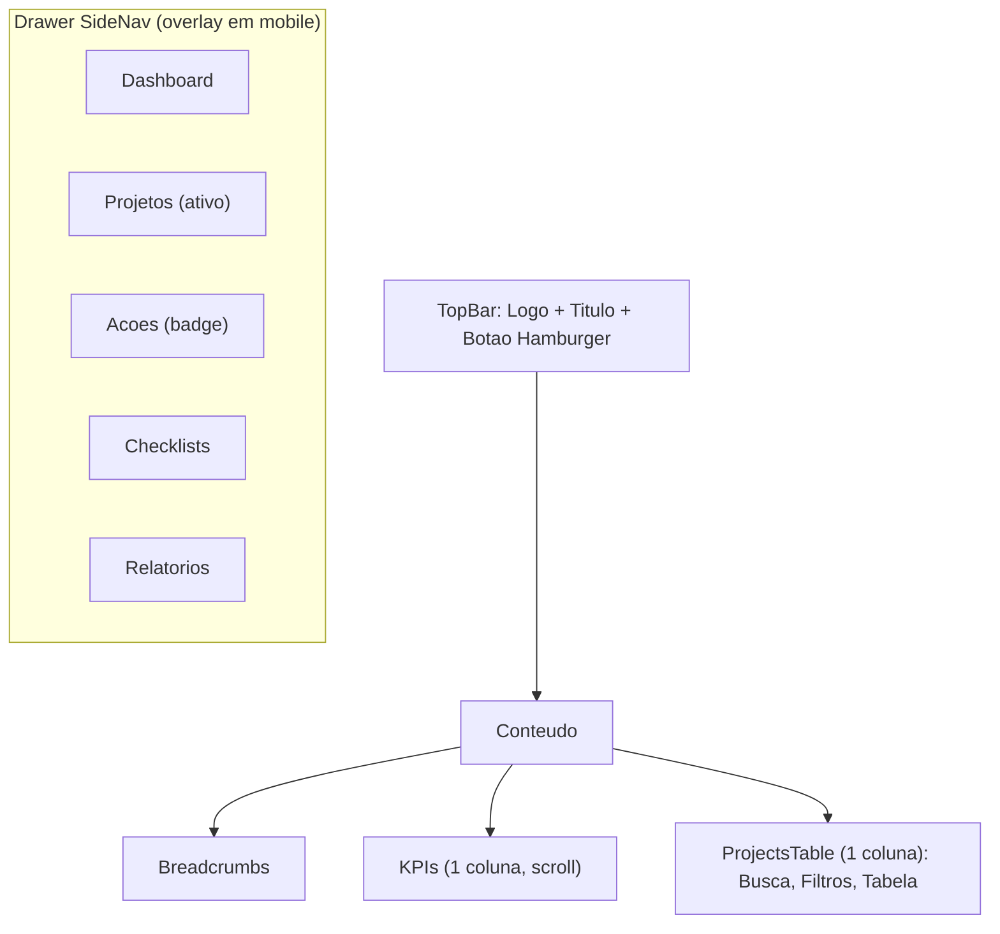

# UX — Wireframes /projects/status (Desktop e Mobile)

## Objetivo
Definir rapidamente a disposição dos elementos (layout), navegação e interações principais para a página Status Executivo, alinhada ao HTML unificado e às decisões aprovadas.

---

## Wireframe (Desktop)


Detalhes:
- SideNav fixa (colapsável em desktop). Item ativo destacado.
- KPIs em 4 col (desktop), 2 col (tablet), 1 col (mobile).
- Tabela com coluna de status (badge), prazo, valor e contagem de ações pendentes.

---

## Wireframe (Mobile)


Detalhes:
- Botão hamburger abre/fecha o drawer (overlay). Fechamento por backdrop.
- Conteúdo empilhado: Breadcrumbs > KPIs > Tabela.

---

## Regras de Interação
- SideNav: hover estados; item ativo destacado; colapsável (desktop) e drawer (mobile).
- Breadcrumbs: cliques navegáveis; último item como estado atual.
- KPIs: estados loading (skeleton) + cores semânticas (info/success/warning/error).
- Tabela: busca por texto, filtros (status/portfólio), ordenação por coluna; estados vazio/erro com mensagem amigável.
- Acessibilidade: ARIA em botões/links/inputs; foco visível; navegação por teclado.

---

## Mapa de Navegação
```mermaid
flowchart LR
  D[/Dashboard/] --> P[/Projects/]
  P --> PS[/Projects Status (/projects/status)/]
  P --> PD[/Project Detail (/projects/:id)/]
  P --> A[/Actions (/actions)/]
```

---

## Mapeamento para Componentes
- TopBar: `src/ui/components/Layout/TopBar.tsx`
- SideNav: `src/ui/components/Layout/SideNav.tsx`
- Breadcrumbs: `src/ui/components/Layout/Breadcrumbs.tsx`
- KPICard: `src/ui/components/Cards/KPICard.tsx`
- ProjectsTable: `src/ui/components/Tables/ProjectsTable.tsx`
- Tokens/cores: `src/ui/tokens/colors.ts`

---

## Próximos passos (UX/UI)
- Validar responsividade em 320/375/768/1024/1440 px.
- Ajustar micro-interações (hover/active/focus) e timings de animação.
- Definir toasts/feedbacks de ação.
- Criar variantes de Empty/Error para tabela e lista de ações.


